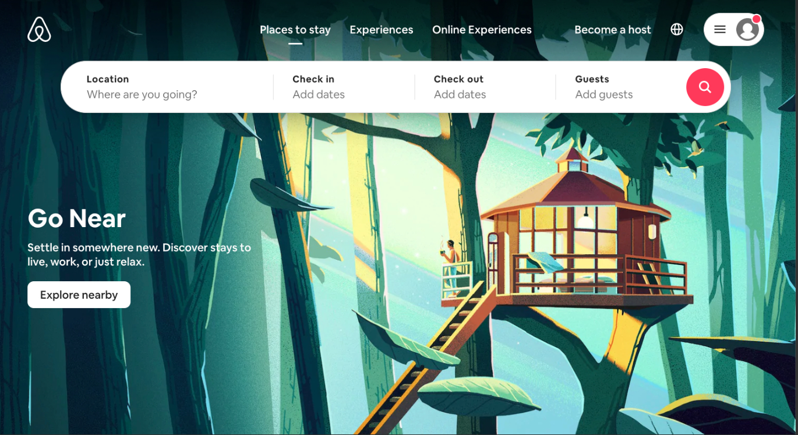

# Code Challenge 3: The AirBnB Thing
### This project is simply a quick recreation of the AirBnB hero page
    - I was instructed to re-create/redesign the current landing page of AirBnB as close to the original as possible using tailwindcss
    - Right now, on AirBnB there is a bg-img of a tree house, I have ommitted that image and have a simple color for my background

#### I have not been able to achieve the exact look, but I am getting close. This project is solely HTML.
#### I am using this repo to play around with tailwind and will keep modifying until I achieve the desired picture above.

### happy coding <3 (;
